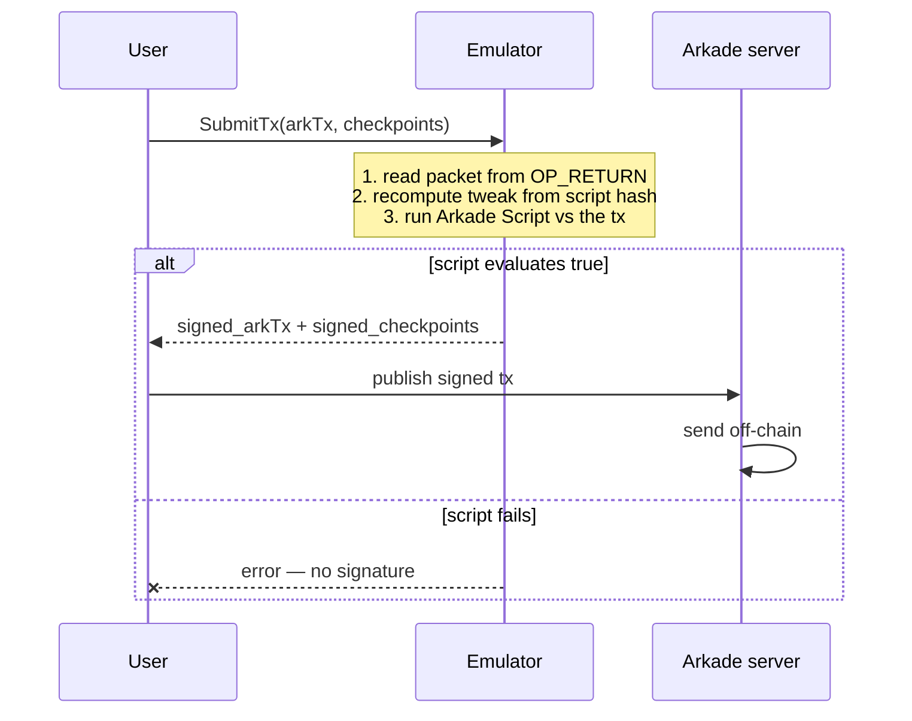

# The Emulator

### *"Introspection is all you need."*

<div class="pt-8 opacity-80">
Covenants on Bitcoin without softfork on Arkade
</div>

<div class="pt-12 text-sm opacity-60">
bonomat
</div>
<div class="pt-2 text-xs opacity-60">
Freedom Tech Summit Prague · June 2026
</div>


---
layout: center
class: text-center
---

[//]: # (Breather 01 — Arkade)

<div class="text-sm opacity-50 tracking-[0.3em] mb-8">CHAPTER 01 / 05</div>

# Arkade

<div class="text-lg opacity-70 mt-4 font-normal">
Not a Bitcoin L2 
</div>

---
layout: two-cols
layoutClass: gap-8
---

[//]: # (Slide 1 — What is Arkade?)

# What is Arkade?

[//]: # (<v-clicks>)

- **Not A Bitcoin L2** Pre-signed bitcoin transactions anchored to a single on-chain output - for fast, cheap, off-chain payments.
- **VTXOs** = *virtual* UTXOs that live inside that shared batch output.
- An operator (**`arkd`**) batches many users into one onchain tx.
- Every VTXO is a **2-of-2** between user and operator + 1 one unilateral exit path.
- Trade-off: instant + non-custodial, but **every move needs the operator to co-sign**.

[//]: # (</v-clicks>)

::right::

<div class="arkade-diagram-wrap">
  <div class="arkade-diagram">
    <svg class="lines" viewBox="0 0 700 300" preserveAspectRatio="xMidYMid meet">
      <polyline points="168,150 218,150" />
      <polyline class="arrow" points="213,146 218,150 213,154" />
      <polyline points="345,150 400,150 400,44 480,44" />
      <polyline points="345,150 400,150 400,117 480,117" />
      <polyline points="345,150 400,150 400,190 480,190" />
      <polyline points="345,150 400,150 400,263 480,263" />
      <polyline class="arrow" points="475,40 480,44 475,48" />
      <polyline class="arrow" points="475,113 480,117 475,121" />
      <polyline class="arrow" points="475,186 480,190 475,194" />
      <polyline class="arrow" points="475,259 480,263 475,267" />
    </svg>
    <div class="tx-box">Transaction</div>
    <div class="batch-box">Batch Output</div>
    <div class="vtxo" style="top: 8px;">VTXO 1</div>
    <div class="vtxo" style="top: 81px;">VTXO 2</div>
    <div class="vtxo" style="top: 154px;">VTXO 3</div>
    <div class="vtxo" style="top: 227px;">VTXO 4</div>
    <div class="caption"><span class="caption-hl">1</span> onchain output &rarr; <span class="caption-hl">4</span> virtual UTXOs</div>
  </div>
</div>

<style>
.arkade-diagram-wrap {
  position: relative;
  width: 525px;
  height: 240px;
  margin: 24px auto 0;
  max-width: 100%;
}
.arkade-diagram {
  position: absolute;
  top: 0;
  left: 0;
  width: 700px;
  height: 320px;
  transform: scale(0.75);
  transform-origin: top left;
  font-family: 'Geist', -apple-system, sans-serif;
}
.arkade-diagram .lines {
  position: absolute;
  inset: 0;
  width: 100%;
  height: 100%;
  pointer-events: none;
}
.arkade-diagram .lines polyline {
  fill: none;
  stroke: #c2e821;
  stroke-width: 1.5;
}
.arkade-diagram .lines .arrow {
  fill: none;
  stroke: #c2e821;
  stroke-width: 1.5;
}
.arkade-diagram .tx-box {
  position: absolute;
  left: 8%;
  top: 50%;
  transform: translateY(-50%);
  background: #a3c410;
  color: #000;
  padding: 14px 22px;
  border-radius: 4px;
  font-size: 13px;
  font-weight: 600;
  letter-spacing: -0.01em;
  white-space: nowrap;
}
.arkade-diagram .batch-box {
  position: absolute;
  left: 32%;
  top: 50%;
  transform: translateY(-50%);
  background: #fff;
  border: 1.5px dashed #C0C0C0;
  padding: 14px 22px;
  border-radius: 20px;
  font-size: 13px;
  font-weight: 600;
  color: #000000;
  letter-spacing: -0.01em;
  white-space: nowrap;
}
.arkade-diagram .vtxo {
  position: absolute;
  right: 14%;
  width: 72px;
  height: 72px;
  border-radius: 50%;
  border: 1.5px dashed #C0C0C0;
  background: #fff;
  display: flex;
  align-items: center;
  justify-content: center;
  font-size: 11px;
  font-weight: 600;
  color: #737373;
}
.arkade-diagram .caption {
  position: absolute;
  bottom: -8px;
  left: 50%;
  transform: translateX(-50%);
  font-size: 11px;
  color: #737373;
  white-space: nowrap;
}
.arkade-diagram .caption-hl {
  color: #c2e821;
  font-weight: 600;
}
</style>

---
layout: center
---

[//]: # (Anatomy of a Bitcoin transaction)

# Anatomy of a Bitcoin transaction

<svg viewBox="0 0 960 400" class="tx-svg" xmlns="http://www.w3.org/2000/svg">
  <!-- big transaction container -->
  <rect class="tx-outer" x="10" y="20" width="800" height="370" rx="12" />

  <!-- header -->
  <text class="tx-title" x="40" y="58" text-anchor="start">Transaction</text>

  <!-- vertical divider -->
  <line class="divider" x1="410" y1="100" x2="410" y2="375" />

  <!-- column headers -->
  <text class="col-header" x="210" y="120" text-anchor="middle">INPUTS</text>
  <text class="col-header" x="610" y="120" text-anchor="middle">OUTPUTS</text>

  <!-- inputs -->
  <rect class="io" x="40" y="140" width="340" height="100" rx="6" />
  <text class="title" x="210" y="175" text-anchor="middle">Input 0</text>
  <text class="sub"   x="210" y="200" text-anchor="middle">prev outpoint + witness</text>

  <rect class="io" x="40" y="260" width="340" height="100" rx="6" />
  <text class="title" x="210" y="295" text-anchor="middle">Input 1</text>
  <text class="sub"   x="210" y="320" text-anchor="middle">prev outpoint + witness</text>

  <!-- outputs -->
  <rect class="io" x="440" y="140" width="350" height="65" rx="6" />
  <text class="title" x="615" y="165" text-anchor="middle">Output 0</text>
  <text class="value" x="615" y="190" text-anchor="middle">50,000 sats  →  Alice</text>

  <rect class="io" x="440" y="220" width="350" height="65" rx="6" />
  <text class="title" x="615" y="245" text-anchor="middle">Output 1</text>
  <text class="value" x="615" y="270" text-anchor="middle">30,000 sats  →  Bob</text>

  <rect class="io" x="440" y="300" width="350" height="65" rx="6" />
  <text class="title" x="615" y="325" text-anchor="middle">Output 2</text>
  <text class="value" x="615" y="350" text-anchor="middle">19,800 sats  →  change</text>

  <!-- UTXO callout pointing at Output 0 -->
  <line class="callout-line" x1="870" y1="172" x2="800" y2="172" />
  <polyline class="callout-arrow" points="806,168 800,172 806,176" />
  <text class="callout-label" x="885" y="178" text-anchor="start">UTXO</text>
</svg>

<div class="pt-4 text-sm opacity-80 text-center">
Each output has a <strong style="color:#c2e821">value</strong> and a <strong style="color:#c2e821">scriptPubKey</strong>. Each input references a previous output's outpoint.
</div>

<div class="pt-1 text-sm opacity-80 text-center">
A <strong>VTXO</strong> is one of these outputs — with a script that says <em>what's allowed to spend it.</em>
</div>

<style>
.tx-svg {
  display: block;
  width: 100%;
  max-width: 780px;
  height: auto;
  margin: 0 auto;
  font-family: 'Geist', -apple-system, sans-serif;
}
.tx-svg rect.tx-outer {
  fill: rgba(194, 232, 33, 0.05);
  stroke: #c2e821;
  stroke-width: 2;
}
.tx-svg text.tx-title {
  fill: #c2e821;
  font-size: 20px;
  font-weight: 700;
  letter-spacing: 0.02em;
}
.tx-svg text.tx-sub {
  fill: rgba(255, 255, 255, 0.55);
  font-size: 12px;
  font-weight: 400;
}
.tx-svg line.divider {
  stroke: rgba(194, 232, 33, 0.35);
  stroke-width: 1;
  stroke-dasharray: 4 4;
  fill: none;
}
.tx-svg text.col-header {
  fill: rgba(255, 255, 255, 0.6);
  font-size: 13px;
  font-weight: 700;
  letter-spacing: 0.18em;
}
.tx-svg rect.io {
  fill: #fff;
  stroke: #C0C0C0;
  stroke-width: 1.5;
  stroke-dasharray: 6 4;
}
.tx-svg text.title {
  fill: #000000;
  font-size: 15px;
  font-weight: 600;
}
.tx-svg text.sub {
  fill: #737373;
  font-size: 12px;
  font-weight: 400;
}
.tx-svg text.value {
  fill: #f7931a;
  font-size: 14px;
  font-weight: 700;
}
.tx-svg line.callout-line,
.tx-svg polyline.callout-arrow {
  stroke: #c2e821;
  stroke-width: 1.5;
  fill: none;
}
.tx-svg text.callout-label {
  fill: #c2e821;
  font-size: 18px;
  font-weight: 700;
  letter-spacing: 0.06em;
}
</style>

---

[//]: # (Slide 2 — Anatomy of a VTXO)

# Anatomy of a VTXO

```ts
vtxoScript = Taproot(
      internalKey: UNSPENDABLE, 
      scriptPaths :
        [
            // Collaborative path (default)
            checkSig(userPK) && checkSig(operatorPK),
        
            // Unilateral exit path
            checkSig(userPK) && relativeTimelock(exitDelay)
        ]
)
```

<div class="pt-6 grid grid-cols-2 gap-6">

<div class="p-4 rounded bg-white/5 border-l-4 border-[#c2e821]/60">

**Collaborative path** — *fast, off-chain*

User **and** operator co-sign every move. Instant settlement, no on-chain footprint.

</div>

<div class="p-4 rounded bg-white/5 border-l-4 border-[#f7931a]/60">

**Unilateral exit** — *the safety valve*

After `exitDelay`, the user alone can claim the VTXO on-chain. The operator can **never** trap funds.

</div>

</div>

<!--
This is the slide that justifies the "non-custodial" claim from slide 1.
The internal key is UNSPENDABLE — no key-path spends — so every move must
go through one of these two leaves. Operator cooperation is convenient,
not required.
-->

---
layout: center
---

[//]: # (VTXO DAG)

# Spends compose, off-chain

<svg viewBox="0 0 1080 360" class="dag-svg" xmlns="http://www.w3.org/2000/svg">
  <defs>
    <marker id="dag-arrowhead" viewBox="0 0 10 10" refX="9" refY="5"
            markerWidth="6" markerHeight="6" orient="auto">
      <path d="M 0 0 L 10 5 L 0 10 z" fill="#c2e821" />
    </marker>
  </defs>

  <!-- lines: Tx → Batch -->
  <line class="dag-line" x1="130" y1="190" x2="166" y2="190" marker-end="url(#dag-arrowhead)" />

  <!-- lines: Batch → Gen 0 -->
  <line class="dag-line" x1="300" y1="190" x2="395" y2="72"  marker-end="url(#dag-arrowhead)" />
  <line class="dag-line" x1="300" y1="190" x2="390" y2="152" marker-end="url(#dag-arrowhead)" />
  <line class="dag-line" x1="300" y1="190" x2="390" y2="220" marker-end="url(#dag-arrowhead)" />
  <line class="dag-line" x1="300" y1="190" x2="395" y2="290" marker-end="url(#dag-arrowhead)" />

  <!-- lines: VTXO 1 → 1a, 1b -->
  <line class="dag-line" x1="452" y1="48"  x2="684" y2="38"  marker-end="url(#dag-arrowhead)" />
  <line class="dag-line" x1="452" y1="56"  x2="684" y2="100" marker-end="url(#dag-arrowhead)" />

  <!-- lines: VTXO 2 → 2a, 2b -->
  <line class="dag-line" x1="452" y1="144" x2="684" y2="170" marker-end="url(#dag-arrowhead)" />
  <line class="dag-line" x1="450" y1="151" x2="686" y2="232" marker-end="url(#dag-arrowhead)" />

  <!-- lines: 1a + 1b + 2a → merge VTXO 5 -->
  <line class="dag-line" x1="735" y1="43"  x2="911" y2="96"  marker-end="url(#dag-arrowhead)" />
  <line class="dag-line" x1="736" y1="105" x2="910" y2="105" marker-end="url(#dag-arrowhead)" />
  <line class="dag-line" x1="735" y1="167" x2="911" y2="114" marker-end="url(#dag-arrowhead)" />

  <!-- Transaction (orange) -->
  <rect class="dag-tx" x="20" y="165" width="110" height="50" rx="4" />
  <text class="dag-tx-text" x="75" y="194" text-anchor="middle">Transaction</text>

  <!-- Batch output (white pill) -->
  <rect class="dag-batch" x="170" y="165" width="130" height="50" rx="25" />
  <text class="dag-batch-text" x="235" y="194" text-anchor="middle">Batch Output</text>

  <!-- Gen 0 VTXOs -->
  <circle class="dag-vtxo" cx="420" cy="50" r="32" />
  <text class="dag-vtxo-text" x="420" y="55" text-anchor="middle">VTXO 1</text>

  <circle class="dag-vtxo" cx="420" cy="140" r="32" />
  <text class="dag-vtxo-text" x="420" y="145" text-anchor="middle">VTXO 2</text>

  <circle class="dag-vtxo" cx="420" cy="230" r="32" />
  <text class="dag-vtxo-text" x="420" y="235" text-anchor="middle">VTXO 3</text>

  <circle class="dag-vtxo" cx="420" cy="310" r="32" />
  <text class="dag-vtxo-text" x="420" y="315" text-anchor="middle">VTXO 4</text>

  <!-- Gen 1 VTXOs (smaller, from VTXO 1 and 2) -->
  <circle class="dag-vtxo small" cx="710" cy="35"  r="26" />
  <text class="dag-vtxo-text small" x="710" y="39"  text-anchor="middle">VTXO 1a</text>

  <circle class="dag-vtxo small" cx="710" cy="105" r="26" />
  <text class="dag-vtxo-text small" x="710" y="109" text-anchor="middle">VTXO 1b</text>

  <circle class="dag-vtxo small" cx="710" cy="175" r="26" />
  <text class="dag-vtxo-text small" x="710" y="179" text-anchor="middle">VTXO 2a</text>

  <circle class="dag-vtxo small" cx="710" cy="245" r="26" />
  <text class="dag-vtxo-text small" x="710" y="249" text-anchor="middle">VTXO 2b</text>

  <!-- Gen 2 merge VTXO (1a + 1b + 2a → 5) -->
  <circle class="dag-vtxo merge" cx="940" cy="105" r="30" />
  <text class="dag-vtxo-text" x="940" y="109" text-anchor="middle">VTXO 5</text>

  <!-- "off-chain" annotation -->
  <line class="dag-divider" x1="340" y1="345" x2="1030" y2="345" />
  <text class="dag-annot" x="685" y="340" text-anchor="middle">all of this happens off-chain</text>
</svg>

<div class="pt-3 text-sm opacity-80 text-center">
One on-chain anchor. Many off-chain spends. <strong>The DAG grows without touching the chain.</strong>
</div>

<style>
.dag-svg {
  display: block;
  width: 100%;
  max-width: 1000px;
  height: auto;
  margin: 0 auto;
  font-family: 'Geist', -apple-system, sans-serif;
}
.dag-svg .dag-line {
  stroke: #c2e821;
  stroke-width: 1.5;
  fill: none;
}
.dag-svg .dag-tx {
  fill: #a3c410;
}
.dag-svg .dag-tx-text {
  fill: #000000;
  font-size: 13px;
  font-weight: 600;
}
.dag-svg .dag-batch {
  fill: #fff;
  stroke: #C0C0C0;
  stroke-width: 1.5;
  stroke-dasharray: 6 4;
}
.dag-svg .dag-batch-text {
  fill: #000000;
  font-size: 13px;
  font-weight: 600;
}
.dag-svg .dag-vtxo {
  fill: #fff;
  stroke: #C0C0C0;
  stroke-width: 1.5;
  stroke-dasharray: 6 4;
}
.dag-svg .dag-vtxo.merge {
  stroke: #c2e821;
  stroke-width: 2;
  stroke-dasharray: none;
}
.dag-svg .dag-vtxo-text {
  fill: #737373;
  font-size: 11px;
  font-weight: 600;
}
.dag-svg .dag-vtxo-text.small {
  font-size: 9.5px;
}
.dag-svg .dag-divider {
  stroke: rgba(194, 232, 33, 0.25);
  stroke-width: 1;
  stroke-dasharray: 4 4;
  fill: none;
}
.dag-svg .dag-annot {
  fill: rgba(255, 255, 255, 0.6);
  font-size: 11px;
  font-style: italic;
  letter-spacing: 0.04em;
}
</style>

<!--
Extends slide 1's diagram. The single on-chain commitment seeded 4 VTXOs;
VTXOs 1 and 2 then got spent off-chain, producing 1a/1b/2a/2b. None of
those spends hit the chain — they're just txs co-signed by the user and
operator (or, with the Emulator, co-signed by a covenant script).
The takeaway: Arkade payments compose into a DAG entirely off-chain.
The on-chain footprint is still just the original commitment tx.
-->

---

[//]: # (Slide 3 — Arkade use cases)

# What can you build on Arkade?

<div class="grid grid-cols-2 gap-4 pt-4">

<div class="p-4 rounded bg-white/5 border-l-4 border-[#c2e821]/60">

**⚡ Instant Bitcoin payments**

Lightning-grade speed — no per-user channel to open, no inbound liquidity to source. One VTXO, many spends.

</div>

<div class="p-4 rounded bg-white/5 border-l-4 border-[#c2e821]/60">

**💵 Other asset and stablecoins**

Issued assets ride inside VTXOs - same unilateral-exit guarantees as native BTC.

</div>

<div class="p-4 rounded bg-white/5 border-l-4 border-[#c2e821]/60">

**💱 Trading & atomic swaps**

Atomic swaps between Arkade assets, or cross-chain to Lightning / mainchain.

</div>

<div class="p-4 rounded bg-white/5 border-l-4 border-[#f7931a]/60">

**🛠 Arkade Script — advanced scripting**

Extra opcodes on top of Bitcoin Script: introspection, hashing, arithmetic. Vaults, **covenants**.

</div>

</div>

<!--
Punchline: Arkade ships now, but the *full* set of flows people want
(async, vaults, delegation, covenant-style payouts) all bump into the
same missing primitive. That's the bridge into the covenant primer.
-->

---
layout: center
class: text-center
---

[//]: # (Breather 02 — Covenants)

<div class="text-sm opacity-50 tracking-[0.3em] mb-8">CHAPTER 02 / 05</div>

# Covenants

<div class="text-lg opacity-70 mt-4 font-normal">
The constraint Bitcoin Script can't express — yet
</div>

---

# What is a covenant?

- Bitcoin Script today gates **who** can spend a UTXO.
- A covenant gates **how** it can be spent.

<div class="pt-6 grid grid-cols-2 gap-6">

<div class="p-4 rounded bg-white/5">

**Regular UTXO**

> "anyone with key `X` can move this *anywhere*"

</div>

<div class="p-4 rounded bg-[#a3c410]/12 border border-[#c2e821]/40">

**Covenant UTXO**

> "this can only be spent to output `Y`, for amount `Z`, after time `T`"

</div>

</div>

<div class="pt-8 text-lg">
A spending constraint that depends on the <em>transaction itself</em> —
not just signatures and preimages.
</div>

<!--
Frame it as "who" vs "how". Every covenant proposal you'll ever read is
just a different way of letting Script look at the spending transaction.
-->

---

# Why you'd want them

[//]: # (<v-clicks>)

- **Lightning async receive** — pay-on-preimage without both parties online at swap time.
- **Non-interactive atomic swaps** — trade assets without online requirement.
- **Delegation** — let someone *move* your coins, but only under script-enforced rules.
- **Vaults** — funds can only move to your cold address, or anywhere else after a delay.
- **Games & fun scripts** — provably-fair betting settled entirely by covenant — dice, coin flips, no trusted house.

[//]: # (</v-clicks>)

<div v-click class="mt-8 p-4 border-l-4 border-[#c2e821] bg-[#c2e821]/10">

The common thread: each one wants the script to <strong>see the spending transaction</strong>
— its outputs, its amounts, its shape.

</div>


---

# What Bitcoin Script can — and can't — do

<div class="grid grid-cols-2 gap-6 pt-4">

<div>

**Today, Script constrains:**

- *who* signs — `OP_CHECKSIG`, multisig, MuSig2
- *when* it spends — `OP_CLTV`, `OP_CSV`
- *what secret* is revealed — hashlocks

</div>

<div>

**Script cannot:**

- read the spending tx's outputs
- enforce "this output must look like *that*"
- check amounts, scriptPubKeys, or versions
- chain commitments across transactions

</div>

</div>

---

[//]: # (Slide 8 — Bridge: you can just co-sign things)

# Bitcoin scripts today

<div class="grid grid-cols-2 gap-8 pt-6">

<div class="p-5 rounded bg-white/5 border-l-4 border-[#ef4444]/60">

**The soft-fork road** 🐢

`OP_CTV` · `OP_CAT` · `OP_CSFS` · `OP_VAULT` · `SIGHASH_ANYPREVOUT`

Each one is years of debate, safety review, and politics. We've been "almost there" for a while now.

</div>

<div class="p-5 rounded bg-white/5 border-l-4 border-[#c2e821]/60">

**Meanwhile, the pragmatic path** 🐇

Run a signer that **only co-signs if your script says it's OK**.

Same expressive power. Ships today. No fork required.

</div>

</div>

<div v-click class="mt-10 text-center text-2xl">

That signer is the <strong>Emulator</strong> &nbsp;→

</div>

<!--
The "you can just co-sign things" framing is intentionally cheeky — it
echoes "you can just do things" / "you can just build things". The point:
while the community works through soft-fork debates, a remote signer that
honestly executes a committed script gives you most of the covenant story
right now. That's our bridge into the Emulator deep-dive.
-->

---
layout: center
class: text-center
---

[//]: # (Breather 03 — The Emulator)

<div class="text-sm opacity-50 tracking-[0.3em] mb-8">CHAPTER 03 / 05</div>

# The Emulator

<div class="text-lg opacity-70 mt-4 font-normal">
A signer that only co-signs if your script says it's OK
</div>

---

[//]: # (Slide 9 — Emulator's trick: tweaked keys)

# The trick: a script-committed pubkey

The Emulator is a daemon holding a key `P`.

It will co-sign **any** VTXO spend — *but only if* the input commits to a script,
and that script **evaluates true** against the spending tx.

<div class="mt-6 p-5 rounded bg-white/5 border-l-4 border-[#c2e821]/60">

**Commit the script into the pubkey itself:**

```text
P_committed = P_emulator + H_tag("ArkScriptHash", arkadeScript) · G
```

</div>

<div class="pt-5 grid grid-cols-2 gap-4 text-sm">

<div>

- **BIP-341-style taproot tweaking**, with a project-specific tag.
- The script bytes never go on-chain in the path itself.
- They're encoded in an OP_RETURN.

</div>

<div>

- The Emulator **recomputes** the tweak from the revealed script.
- If the script evaluates true against the tx, it signs.
- Otherwise: silence. The coin can't move that way.

</div>

</div>

<!--
This is the heart of the whole thing. The pubkey *is* a commitment
to the script. Standard taproot tweak math, just with a custom tag. The
signer's behaviour is "execute the committed bytecode, sign on success".
-->

---

[//]: # (Slide 9b — What the spending tx carries)

# Where does the script live?

<div class="text-sm opacity-80 mb-5">
Not in the input's tapscript. The committed script rides the <strong>spending transaction itself</strong> — as a packet in an <strong style="color:#c2e821">OP_RETURN</strong> extension output.
</div>

<div class="flex items-stretch gap-4 text-xs">

<div class="flex-1 rounded-lg border border-[#c2e821]/40 bg-[#c2e821]/5 p-3">
  <div class="text-[#c2e821] font-bold text-sm mb-2">Spending tx</div>
  <div class="grid grid-cols-2 gap-2">
    <div>
      <div class="opacity-50 tracking-widest mb-1">INPUTS</div>
      <div class="rounded bg-white text-black p-2 mb-1">Input 0 · <strong>covenant VTXO</strong><br><span class="opacity-60">Emulator-tweaked leaf</span></div>
      <div class="rounded bg-white text-black p-2">Input 1 · other VTXO</div>
    </div>
    <div>
      <div class="opacity-50 tracking-widest mb-1">OUTPUTS</div>
      <div class="rounded bg-white text-black p-2 mb-1">Output 0 · <span style="color:#f7931a;font-weight:600">pot → winner</span></div>
      <div class="rounded border border-[#c2e821] bg-[#c2e821]/15 p-2 text-[#c2e821] font-semibold">Output 1 · OP_RETURN<br><span class="opacity-80 font-normal">extension · 0 sats</span></div>
    </div>
  </div>
</div>

<div class="flex items-center text-2xl text-[#c2e821]">→</div>

<div class="flex-1 rounded-lg border border-[#c2e821]/60 bg-white/5 p-3 font-mono leading-relaxed">
  <div class="text-[#c2e821] font-bold mb-2">EmulatorPacket <span class="opacity-50 font-normal">· one per covenant input</span></div>
  <div><span class="opacity-50">vin</span>&nbsp;&nbsp;&nbsp;&nbsp;: 0</div>
  <div><span class="opacity-50">script</span>&nbsp;: &lt;arkade-script bytes&gt; <span class="text-[#c2e821]">← the covenant</span></div>
  <div><span class="opacity-50">witness</span>: [output_idx, other_input_idx]</div>
</div>

</div>

<div class="pt-5 text-xs opacity-70 text-center">
The Emulator reads the packet, re-derives <code>H_tag("ArkScriptHash", script)</code> to confirm it matches the tweaked key, runs the script against <em>this</em> tx — then signs. Apps can ride <strong>extra</strong> packets too — e.g. CoinFlip's secret reveals, pulled inside the script with <code>INSPECTPACKET</code>.
</div>

<!--
This is the slide that grounds "the script rides in an OP_RETURN" — the
thing that's otherwise hand-waved. Points to land:
- The covenant script bytes are NOT in the leaf's tapscript. The leaf only
  holds the multisig with the Emulator-tweaked key. The bytes travel with
  the SPENDING tx, in an Ark extension output (OP_RETURN-style, 0 sats).
- The EmulatorPacket carries, per covenant input: vin, the arkade-script
  bytes, and the witness stack to push before running it (the covenant
  args — e.g. output_idx + other_input_idx for atomicSweep).
- The Emulator pulls the packet, recomputes H_tag("ArkScriptHash", script),
  checks it matches the tweaked pubkey in that input's leaf, runs the
  script vs this tx, signs only on success.
- Apps can attach OTHER packets too — CoinFlip rides two reveal packets
  (0x10 player, 0x11 creator) that the win-leaf script reads with
  INSPECTPACKET. That's the forward reference to the CoinFlip win leaf.
Source: addPacket in contract-workflows-prototype/src/emulator.ts;
packets in src/packets.ts.
-->

---

[//]: # (Slide 10 — Full taptree with covenant path)

# VTXO, with an Emulator leaf

```ts
vtxoScript = Taproot(
  internalKey: UNSPENDABLE,
  scriptPaths: [
    // Covenant path — the script does the work
    checkSig(operatorPK) && checkSig(P_committed),
    //                                ↑ tweaked by H_tag("ArkScriptHash", arkadeScript)

    // Unilateral exit — the safety valve
    checkSig(userPK) && relativeTimelock(exitDelay)
  ]
)
```

<div class="pt-6 grid grid-cols-2 gap-6">

<div class="p-4 rounded bg-white/5 border-l-4 border-[#c2e821]/60">

**Covenant path** — *async, script-enforced*

Operator + Emulator. The Emulator signs **only** if the committed Arkade script evaluates true against the spending tx. **No user signature required** — that's what makes it covenant-like.

</div>

<div class="p-4 rounded bg-white/5 border-l-4 border-[#f7931a]/60">

**Unilateral exit** — *the safety valve*

User alone, after `exitDelay`. Operator and Emulator can both vanish; the user still walks away on-chain.

</div>

</div>

<!--
The new middle leaf is what enables async flows (HTLCs, swaps, delegation).
Because the Emulator enforces the spending rules in script, the *user*
doesn't have to be online to authorise. The unilateral exit still
guarantees non-custody — if the operator and Emulator both vanish,
the user walks away on-chain.
-->

---
layout: center
---

[//]: # (Slide 11 — User ↔ Emulator: SubmitTx)

# How the Emulator signs



<!--
One RPC, one round-trip. The user hands the Emulator an Ark PSBT
(plus any checkpoint PSBTs). The Emulator pulls the emulator
packet from the tx's OP_RETURN, finds the script associated with each
input it's responsible for, recomputes the BIP-341-style tweak to confirm
the script matches what the pubkey was committed to, then runs the
Arkade Script against the spending tx. If the script evaluates true, it
signs the PSBT and returns it. Otherwise: error. With the signature in
hand, the user takes the fully-signed tx to the Arkade server (ASP) to
publish and settle it off-chain.

(There's also a separate batch-session flow with SubmitIntent +
SubmitFinalization for participating in arkd commitment rounds — but
SubmitTx is the canonical "I want to spend a covenant VTXO" path,
and it's what test/htlc_test.go uses.)
-->

---
layout: center
class: text-center
---

[//]: # (Breather 04 — Show me the code)

<div class="text-sm opacity-50 tracking-[0.3em] mb-8">CHAPTER 04 / 05</div>

# Show me the code

<div class="text-lg opacity-70 mt-4 font-normal">
Real-world covenants, today
</div>

---

[//]: # (Slide 13 — Real example: Banco)

# Banco: non-interactive swaps 🔄

`github.com/arkade-os/banco`

**Maker** creates an offer, locks funds in a covenant VTXO, then **goes offline.** **Taker** discovers the offer later and fulfills it — atomically, in one Ark tx.

<div class="pt-4 grid grid-cols-2 gap-4 text-sm">

<div class="p-3 rounded bg-white/5 border-l-4 border-[#c2e821]/60">

**Why the maker can disappear**

The covenant script enforces, on the fulfillment tx:

- output 0 pays the **maker's** scriptPubKey
- output 0 value ≥ `wantAmount` (sats or assets)

No maker signature at fulfillment. 

</div>

<div class="p-3 rounded bg-white/5 border-l-4 border-[#c2e821]/60">

**Three taptree leaves**

- **Fulfill** — covenant + Emulator co-sign
- **Cancel** — maker reclaims after CLTV
- **Exit** — unilateral CSV fallback

</div>

</div>

<div class="pt-3 text-xs opacity-70 text-center">
Live walkthrough:
<a href="https://github.com/arkade-os/banco/blob/master/src/maker.ts" target="_blank"><code>src/maker.ts</code></a> ·
<a href="https://github.com/arkade-os/banco/blob/master/src/taker.ts" target="_blank"><code>src/taker.ts</code></a> ·
<a href="https://github.com/arkade-os/banco/blob/master/src/offer.ts" target="_blank"><code>src/offer.ts</code></a>
</div>

<!--
Banco is the flagship Arkade Script + Emulator product.
Walking through live, the spots to land on:
- src/maker.ts → createOffer: builds the covenant script and the offer TLV
- src/offer.ts → encode/decode: the TLV format (mentioned briefly in README)
- src/taker.ts → fulfill: builds the fulfillment tx, hits the Emulator
The key insight to call out: the maker doesn't sign the fulfillment.
The script + Emulator do. That's what makes it "non-interactive."
With CTV/CAT this would be consensus-enforced; Banco gets you there today.
-->

---

[//]: # (Slide 13b — Banco maker + taker scripts)

# Banco, in arkade-script

<div class="grid grid-cols-2 gap-5 pt-2">

<div>

**Maker — the covenant it commits** <span class="opacity-50 text-xs">`offer.ts`</span>

```
# fulfillScript — wanting BTC, full fill
# pins the taker's fulfillment tx:

0  INSPECTOUTPUTVALUE              # output 0 value
<wantAmount> GREATERTHANOREQUAL    # … ≥ wantAmount
VERIFY
0  INSPECTOUTPUTSCRIPTPUBKEY       # output 0 spk
1  EQUALVERIFY                     # … taproot (v1)
<makerWP>  EQUAL                   # … pays the MAKER
```

<div class="text-xs opacity-70 mt-2">
"Whoever spends me <strong>must</strong> send ≥ <code>wantAmount</code> to the maker." No maker signature needed.
</div>

</div>

<div>

**Taker — reconstruct leaf & hand off** <span class="opacity-50 text-xs">`taker.ts`</span>

```ts
// the fulfill leaf: 2-of-2, no taker key
fulfillLeaf = Multisig[
  serverPubKey,
  computeArkadeScriptPublicKey(
    emulatorPubkey,      // ← tweaked by
    covenantScript,      //   the covenant
  ),
]

// 1 build tx: output 0 → maker, ≥ wantAmount
// 2 attach covenantScript as a packet
// 3 submit to the Emulator
```

<div class="text-xs opacity-70 mt-2">
The Emulator runs the covenant against the tx, signs the tweaked slot; <strong>arkd</strong> finalizes.
</div>

</div>

</div>

<div class="pt-3 text-xs opacity-50 text-center">
Asset swaps swap line 1 for <code>&lt;wantTxid&gt; 0 INSPECTOUTASSETLOOKUP VERIFY</code>; partial fills add <code>MUL/DIV</code> ratio math + a self-send change leg.
</div>

<!--
These are the real scripts from github.com/arkade-os/banco (HEAD aab5d0e).
- Maker side: Offer.fulfillScript in src/offer.ts. The covenant is just
  "output 0 pays the maker ≥ wantAmount". For asset-want it's the same
  shape with INSPECTOUTASSETLOOKUP instead of INSPECTOUTPUTVALUE.
- Taker side: Taker.fulfillOffer in src/taker.ts. The taker reconstructs
  the fulfill leaf — a 2-of-2 Multisig[server, emulator⊕covenant] — using
  computeArkadeScriptPublicKey(emulatorPubkey, covenantScript). Note the
  taker's OWN key is NOT in the leaf; the taker just builds a conforming
  tx and submits. The Emulator co-signs only because the covenant passes.
- NOTE on naming: the banco repo still calls the daemon the "introspector"
  in code — introspectorPubkey, IntrospectorPacket, RestIntrospectorProvider.
  It's the same component this talk calls the Emulator; I relabeled it in
  the slide for consistency. Mention this if someone reads the source.
- The partial-fill scripts (btcForAsset / assetForBtc / assetForAsset) are
  the heavy ones — ratioNum*amount/ratioDen, FINDASSETGROUPBYASSETID,
  self-send change back to the swap address. Out of scope for the slide.
-->

---

[//]: # (Slide 14 — Real example: CoinFlip)

# CoinFlip: a bet settled by covenant 🎲

`github.com/arkade-os/coinflip`

Player vs. house. Both **commit** to `SHA256(secret)`, then **reveal** — the two secrets decide the winner. Each stake sits in its **own escrow VTXO**, and the Emulator settles the pot. **The player signs nothing on the win path.**

<div class="pt-4 grid grid-cols-2 gap-4 text-sm">

<div class="p-3 rounded bg-white/5 border-l-4 border-[#c2e821]/60">

**Provably fair**

Secret *byte-length* encodes a digit. `roll = (houseDigit + playerDigit) mod n`; player wins iff `roll ∈ [lo, target)`. Both sides pick at random, and the committed hash binds each before anyone reveals.

</div>

<div class="p-3 rounded bg-white/5 border-l-4 border-[#c2e821]/60">

**Atomic settlement**

One `2-input → 1-output` sweep pays the whole pot to the winner. Each leaf's covenant pins the **other** escrow as an input — a single-stake sweep can't satisfy it. Neither side can abort and run.

</div>

</div>

<div class="pt-3 text-xs opacity-70 text-center">
Both outcomes covenant-pinned · the operator only <em>submits</em>, never signs · every collab leaf has a CSV unilateral-exit mirror
</div>

<!--
CoinFlip is the second flagship Emulator app, alongside Banco.
The story to tell:
- Two escrows, one per party, into the same taptree — settlement is
  per-party so neither can abort and steal the other's stake.
- The win is settled entirely by [arkd_server, emu_tweaked]. The operator's
  key isn't even in the multisig — it just *submits* the unsigned PSBT.
  The Emulator runs the covenant and signs; arkd co-signs. Player signs nothing.
- Current escrow is the v3 10-leaf taptree: 5 collab leaves + 5 CSV-gated
  unilateral-exit mirrors. The win/forfeit exits keep the emu-tweaked key,
  so atomicity survives arkd going dark; only plain refund drops the Emulator.
Next slide: the actual win-leaf arkade-script.
-->

---

[//]: # (Slide 15a — CoinFlip win leaf · the predicate)

# The win leaf — deciding the winner

```
# Player-win leaf — the Emulator runs this before it co-signs
# entry stack: [output_idx, other_input_idx]   (covenant args)

# 1 · pull both reveals (they ride the spending tx as packets)
0x10 INSPECTPACKET VERIFY              # player reveal
0x11 INSPECTPACKET VERIFY              # creator reveal

# 2 · bind each reveal to its commitment
DUP SHA256 <playerHash>  EQUALVERIFY
SWAP DUP SHA256 <creatorHash> EQUALVERIFY

# 3 · roll = (creatorDigit + playerDigit) mod n
1 LEFT BIN2NUM   SWAP   1 LEFT BIN2NUM
ADD  <n> MOD   <lo> <target> WITHIN    # player wins iff roll ∈ [lo, target)
```

<div class="pt-4 p-3 rounded bg-white/5 border-l-4 border-[#c2e821]/60 text-sm">

**The predicate** — the Emulator's signature *is* the proof that both reveals matched their commits **and** the roll landed in the player's band. No valid roll → no signature.

</div>

<div class="pt-3 text-xs opacity-50 text-center">
The house-win leaf is the same body + <code>OP_NOT</code>. Out-of-range-digit handling elided for clarity.
</div>

<!--
Real v3 win-condition predicate — packages/lib/src/arkade-win.ts
(buildVariableOddsWinPredicate).
- INSPECTPACKET (0xf4): the reveals ride the spending tx as extension
  packets, NOT the tapscript witness — the witness only carries covenant
  args + multisig sigs. The Emulator pulls 0x10 (player) and 0x11 (creator).
- The digit trick: 1 LEFT BIN2NUM reads the first byte of each reveal as
  the digit; n is capped at 128 so the digit fits one CScriptNum byte.
- Result on the stack: 1 if the player won, else the script aborts /
  pushes 0. The covenant on the next slide consumes this verdict.
-->

---

[//]: # (Slide 15b — CoinFlip win leaf · the covenant)

# …then pin the payout

```
# the predicate left `playerWins` on the stack — require it:
VERIFY                                 # predicate must hold — then…

# atomic-sweep covenant: pin destination + amount
INSPECTINPUTVALUE  <otherStake> EQUALVERIFY
DUP INSPECTOUTPUTSCRIPTPUBKEY 1 EQUALVERIFY <winnerScript> EQUALVERIFY
INSPECTOUTPUTVALUE <pot> EQUAL
```

<div class="pt-4 p-3 rounded bg-white/5 border-l-4 border-[#f7931a]/60 text-sm">

**The covenant** — `atomicSweep` locks the spend: output 0 pays the **winner** exactly the **pot**, and the **other escrow** must be spent in the same tx. Destination + amount, pinned.

</div>

<div class="pt-3 text-xs opacity-50 text-center">
Full leaf = <code>predicate · VERIFY · atomicSweep</code>. The Emulator derives its tweaked key — and signs — only when the whole thing evaluates true.
</div>

<!--
Real v3 covenant — covenants.atomicSweep from contract-workflows-prototype,
appended after the predicate in buildVariableOddsWinArkadeScript.
- The whole leaf is `predicate VERIFY atomicSweep`. The Emulator only
  derives its tweaked key after this evaluates true — so a winning
  signature can't exist for a losing roll or a wrong payout.
- atomicSweep pins BOTH the destination (output 0 → winner's pkScript)
  and the amount (= the full pot), AND requires the other escrow as an
  input (INSPECTINPUTVALUE <otherStake>) — that's what makes the two-stake
  sweep atomic.
- Same machinery as Banco's covenant, sized up to a real two-party game.
-->

---
layout: center
class: text-center
---

[//]: # (Breather 05 — Summary)

<div class="text-sm opacity-50 tracking-[0.3em] mb-8">CHAPTER 05 / 05</div>

# Summary

---


[//]: # (Slide 15 — Closing summary)

# Introspection is all you need

<div class="pt-6 grid grid-cols-3 gap-4 text-sm text-left max-w-4xl mx-auto">

<div class="p-3 rounded bg-white/5 border-l-4 border-[#c2e821]/60">

**The trick**

Tweak a signer's pubkey with `H_tag("ArkScriptHash", script)`. The pubkey is a commitment to the script.

</div>

<div class="p-3 rounded bg-white/5 border-l-4 border-[#c2e821]/60">

**The result**

Covenant-like behaviour for Arkade VTXOs — **today**, no soft-fork needed.

</div>

<div class="p-3 rounded bg-white/5 border-l-4 border-[#c2e821]/60">

**The migration**

We can build the flows now. When CTV / CAT / CSFS land, lift the same scripts onto consensus.

</div>

</div>

<div class="pt-12 text-3xl">
Questions?
</div>

<div class="pt-8 text-xs opacity-50">
Freedom Tech Summit Prague · June 2026
</div>

<!--
The "migration path" line is the key framing for skeptics in the audience.
Emulator isn't a replacement for real covenants — it's a prototype
harness for covenant-style apps that ships before any soft-fork.
When CTV/CAT/CSFS eventually land (and they will), the same Arkade scripts
lift onto consensus and the Emulator becomes a legacy oracle, or
retires entirely.
-->


